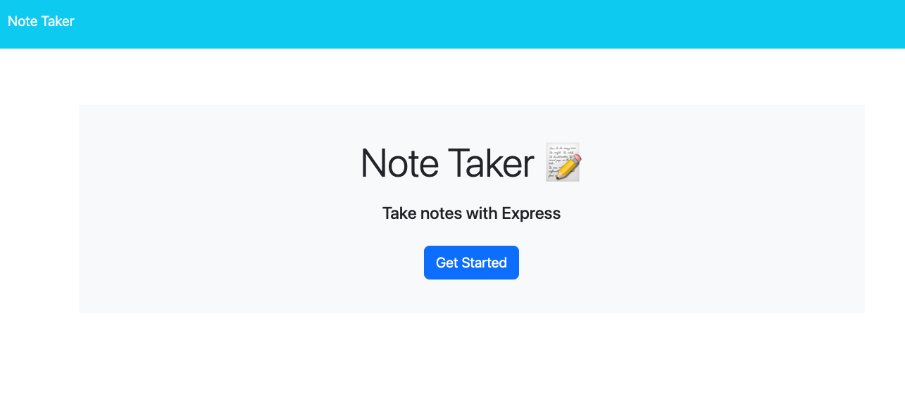
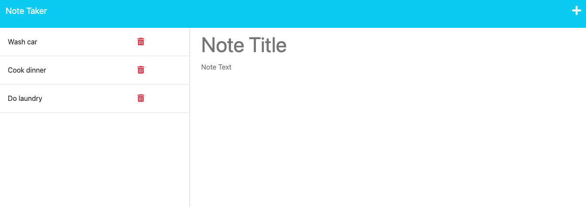

# APNoteTaker

AP NoteTaker is a simple application that allows users to record notes, such as "to-do" items, to help them organize their tasks. When a user loads the application they are taken to a homescreen (index.html) where they are prompted with a button to Get Started. Clicking on the button takes them to the notes page (notes.html), where they see any saved notes in a left column and prompts to create a new note by title and text. When the user enters both title and text they are prompted with a save icon at the upper right. When they click the save button their new note is added to the left column. They can add more notes or remove saved notes by clicking on the trash icon next to the note they wish to remove.

## Technology

This app contains files for both the front end as well as the back end. It utilizes an Express.js back end to save and retrieve notes from a json database. It uses the fs module to store and retrieve the notes with GET and POST API routes. It also uses a DELETE route to remove notes. The app is deployed through Heroku.

## Screenshots

## Credits

Special thanks for my tutoring session for assistance implementing the DELETE API route.

## Deployed Link

[Here is a link to the deployed application](https://apnotetaker-0d02d2cafe60.herokuapp.com/)

